# AI E-Commerce Operations Brain — Design Document

> **Document type**: High-Level Design (HLD) + Low-Level Design (LLD)  
> **System version**: 1.1.0  
> **Status**: Implemented and operational  
> **Last updated**: June 2026

---

# PART I — HIGH-LEVEL DESIGN (HLD)

---

## 1. Executive Summary

### What
The **AI E-Commerce Operations Brain** is an autonomous, multi-agent AI system that continuously monitors an e-commerce business and answers operational questions — in natural language — across four domains simultaneously: sales, inventory, marketing, and customer support.

A business user types or speaks a question such as _"Why did revenue drop 18% yesterday?"_ and receives a structured root-cause report with proposed actions, historical context from similar past incidents, and — when an action is required — a human approval step before anything is executed.

### Why
E-commerce operations generate dozens of signals across fragmented dashboards (revenue metrics, stock levels, campaign performance, complaint queues). Identifying a root cause that spans multiple domains requires a human analyst to manually correlate data across all four systems. This typically takes 1–3 hours and depends entirely on the analyst's experience and shift availability.

This system performs that correlation automatically, in under 15 seconds, and backs every finding with measurable evidence rather than model confidence scores.

### Key Outcomes
| Metric | Value |
|---|---|
| Average investigation time | 7–15 seconds |
| Token cost for 95% of queries (rules routing) | Zero tokens for routing |
| Domains correlated in parallel | Up to 4 simultaneously |
| Historical memory depth | Unlimited (pgvector cosine similarity) |
| Human approval required for actions | Always (HITL gate) |

---

## 2. Business Context and Problem Statement

### The Problem
An e-commerce analyst observing a 20% revenue drop faces four independent data sources:
- Sales dashboard (revenue, orders, AOV, region)
- Inventory system (stock levels, stockouts, restock candidates)
- Marketing platform (campaigns, ROAS, ad spend)
- Customer support queue (complaints, refunds, sentiment)

The analyst must manually query each, correlate the findings, form a hypothesis, and decide on an action. This is slow, inconsistent across analysts, and unavailable outside business hours.

### The Solution
A multi-agent system where each domain has a dedicated AI agent with access to live data via its own MCP server. The agents run in parallel, their outputs are scored for evidence quality, and a synthesis LLM produces a root-cause report. Human approval gates any state-changing action. Every resolved investigation is stored in a searchable memory, so future similar incidents surface historical context automatically.

---

## 3. System Architecture Overview

### High-Level Request Flow

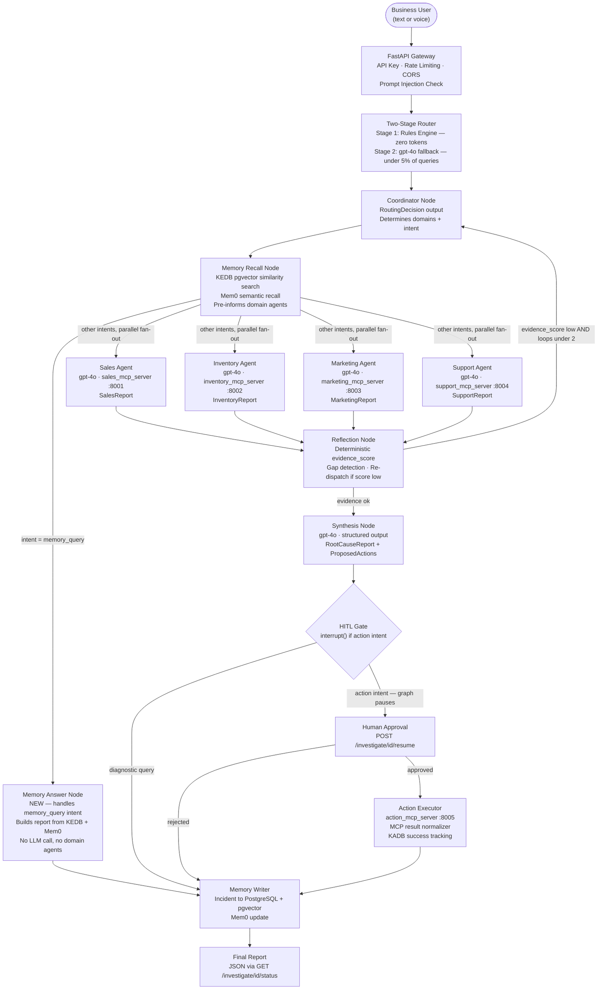

---

## 4. Component Overview

### Four Execution Paths

The system has four distinct paths through the graph depending on intent:

| Intent | Path | LLM calls | Agents spawned | HITL |
|---|---|---|---|---|
| `memory_query` | guardrail → coordinator → memory_recall → **memory_answer** → memory_writer | 0 | 0 | No |
| `diagnose` | guardrail → coordinator → memory_recall → domain agents → reflection → synthesis → hitl → memory_writer | 5–6 | 1–4 | No |
| `report` | same as diagnose, all 4 agents always | 6 | 4 | No |
| `action` | same as diagnose + HITL gate + action_executor | 6 | 1–4 | **Yes** |

### Component Responsibilities

| Component | Type | Responsibility |
|---|---|---|
| FastAPI Gateway | Sync API layer | API key auth, rate limiting, CORS, request injection check, background task dispatch |
| Rules Engine | Deterministic | Classifies 95% of queries in < 1 ms with zero tokens using ordered regex rules |
| Coordinator | Graph node (LLM optional) | Produces `RoutingDecision` — domains to activate and intent classification |
| Memory Recall | Graph node (deterministic) | Embeds query locally, cosine-similarity search in KEDB + pgvector, Mem0 semantic recall |
| Memory Answer | Graph node (deterministic) | **New.** Handles `memory_query` intent: builds a `RootCauseReport` entirely from KEDB/Mem0 results, no LLM call |
| Domain Agents (×4) | Graph nodes (gpt-4o) | Each calls its dedicated MCP server for live data, returns a typed Pydantic report |
| Reflection | Graph node (deterministic) | Computes `evidence_score` from 5 weighted Python signals, decides whether to re-dispatch |
| Synthesis | Graph node (gpt-4o) | Merges domain reports into `RootCauseReport` + `ProposedActions` with KADB success rates |
| HITL | Graph node (deterministic) | Dry-runs actions, calls `interrupt()`, persists full state to PostgreSQL, waits for human |
| Action Executor | Graph node (async dispatcher) | Calls `action_mcp_server :8005` with approved actions after HITL resume |
| Memory Writer | Graph node (deterministic) | Persists resolved incident to PostgreSQL + pgvector, updates Mem0 and KADB counters |
| MCP Servers (×5) | Independent FastMCP services | Each exposes domain-specific read-only tools (8001–8004) or action tools (8005) via SSE |

---

## 5. Technology Stack and Rationale

| Layer | Technology | Why |
|---|---|---|
| **Orchestration** | LangGraph | Stateful graph with `interrupt()` for HITL, `Send()` for parallel fan-out, PostgresSaver for state persistence across restarts |
| **LLM** | Azure OpenAI gpt-4o | Required for tool-call structured output, cross-domain reasoning, and reliable JSON schema adherence |
| **Routing LLM fallback** | gpt-4o (same deployment) | Structured JSON routing only — no complex reasoning. Kept same deployment to avoid separate mini deployment management |
| **Local embeddings** | Azure OpenAI text-embedding-3-small (1536-dim) | Semantic memory search for KEDB and incident recall |
| **Agent framework** | LangChain + custom ReAct loop | Provides tool binding and structured output; custom ReAct loop written to avoid langgraph-prebuilt namespace collision with LangGraph 1.2.2 |
| **API** | FastAPI | Async-native, auto-generated OpenAPI docs, Pydantic integration, background task support |
| **Tool protocol** | Model Context Protocol (FastMCP) | Decoupled tool servers over SSE; domain agents never call Python functions directly |
| **Primary database** | PostgreSQL 16 + pgvector | Relational storage for incidents + vector similarity search in the same database |
| **Session memory** | Mem0 | Semantic, natural-language memory layer on top of pgvector for conversational recall |
| **Cache / status** | Redis | In-process investigation status store; survives API restarts |
| **Rate limiting** | slowapi | Per-IP rate limiting to prevent runaway LLM costs |
| **Observability** | structlog + OpenTelemetry + LangSmith | Structured JSON logs, distributed traces, LLM prompt/token tracing |
| **Frontend** | React + Vite | Polling-based SPA; real-time status via `/status` endpoint |
| **Containerisation** | Docker Compose | All services in one compose file for local dev and deployment |

---

## 6. Security Architecture

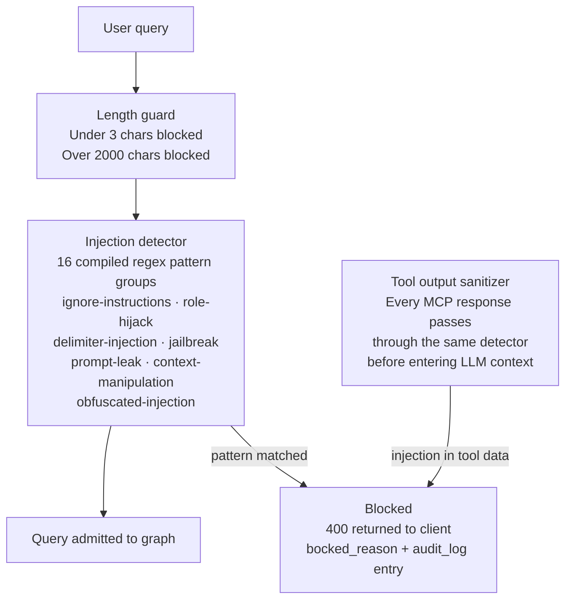

**Security controls applied at every layer:**

| Layer | Control |
|---|---|
| Transport | API key required on every endpoint (`X-API-Key` header); 401 on missing or wrong key |
| Rate limiting | `slowapi` per-IP limit; 429 on excess to prevent LLM cost abuse |
| Input | Injection detector on user input before graph starts (FastAPI layer) |
| Graph | Injection detector runs again in `guardrail_node` inside the graph — belt-and-suspenders for resumed states |
| Tool outputs | Every MCP tool response sanitized through the same 16-pattern detector before reaching any LLM |
| Actions | All action tools default `dry_run=True`; real execution requires explicit `dry_run=False` set only by `action_executor` after HITL approval |
| Secrets | All credentials loaded from `.env` via `pydantic-settings`; nothing hardcoded |
| CORS | Restricted to `localhost:3000` in dev; configurable per environment |

---

## 7. Scalability and Design Trade-offs

### Parallelism Model
The system uses two levels of parallelism:
- **Level 1 (agent fan-out):** LangGraph `Send()` dispatches only the required domain agents simultaneously. Total wait = slowest single agent, not the sum of all agents.
- **Level 2 (tool fan-out):** Inside each agent, all MCP tools are called concurrently via `asyncio.gather`. A 5-tool agent has the same latency as a 1-tool agent.

### State Persistence
LangGraph `PostgresSaver` checkpoints the full `GraphState` to PostgreSQL at every node transition. This means:
- Server can restart mid-investigation without losing state
- HITL can pause indefinitely — the user can approve 6 hours later
- Full execution history is queryable

### Memory Growth
The KEDB and incident tables grow over time and improve the system — more historical incidents mean better `memory_answer` responses and richer pre-context for domain agents. There is no degradation from accumulation; pgvector cosine similarity search uses an index.

### What This System Does Not Do
- It does not replace a BI platform. It answers operational questions; it does not replace dashboards.
- It does not autonomously execute actions. Every state-changing action requires human approval.
- It does not stream partial results to the frontend. The polling model was chosen for simplicity; SSE streaming is architecturally possible via the `/stream` endpoint stub.

---

# PART II — LOW-LEVEL DESIGN (LLD)

---

## 8. LangGraph State Machine — Detailed

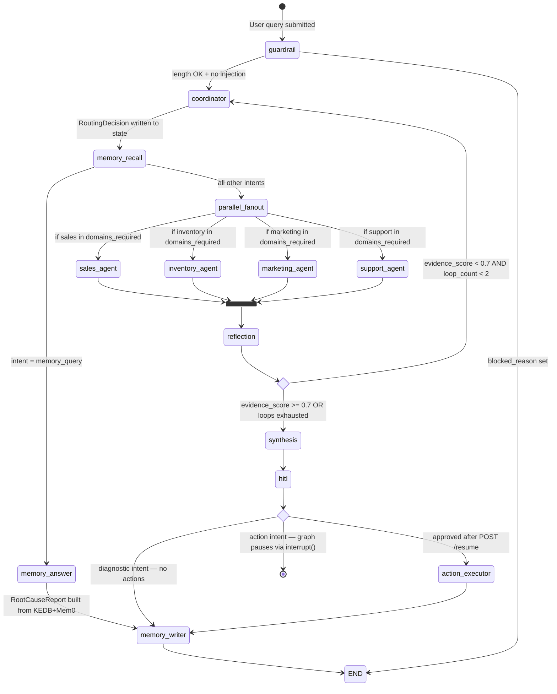

---

## 9. Node-by-Node Specification

### `guardrail_node`

| Attribute | Value |
|---|---|
| Type | Deterministic |
| Inputs | `query`, `query_id`, `session_id` |
| Outputs | `investigation_start_ms`, `audit_log` entry, or `blocked_reason` |
| Logic | 1. Length check (3 < len < 2000). 2. 16-pattern compiled regex injection check. |
| Failure mode | Sets `blocked_reason`; conditional edge routes to `END` |
| LLM used | None |

### `coordinator_node`

| Attribute | Value |
|---|---|
| Type | Deterministic (Stage 1) / LLM optional (Stage 2) |
| Inputs | `query` |
| Outputs | `routing_decision`, `intent`, `domains_required`, `routing_confidence`, `hitl_status="pending"` |
| Stage 1 | Rules engine — 17 ordered compiled regex patterns, first match wins, `routing_confidence=0.95` |
| Stage 2 | Triggered only when `routing_confidence < 0.7`. Calls gpt-4o with structured JSON prompt. |
| Intent normalization | Module-level `_INTENT_ALIASES` dict normalizes LLM-returned synonyms ("analyze" → "diagnose") |
| Fallback | If LLM call fails: `intent="diagnose"`, all 4 domains, `confidence=0.5` |

### `memory_recall_node`

| Attribute | Value |
|---|---|
| Type | Deterministic (local embedding + SQL) |
| Inputs | `query`, `session_id` |
| Outputs | `memory_context: MemoryContext` |
| KEDB search | Embeds query with Azure OpenAI text-embedding-3-small (1536-dim), cosine-similarity `ORDER BY embedding <=> $1 LIMIT 3` |
| Mem0 recall | `recall_similar(query, session_id)` — top-3 semantic hits |
| Output schema | `MemoryContext(kedb_entries, similar_incidents, mem0_memories, historical_pattern_found)` |

### `memory_answer_node` _(added in v1.1)_

| Attribute | Value |
|---|---|
| Type | Deterministic |
| Triggered when | `intent == "memory_query"` — routed here by `_after_memory_recall_edge` |
| Inputs | `memory_context`, `query`, `investigation_start_ms` |
| Outputs | `root_cause_report: RootCauseReport`, `audit_log` entry |
| Logic | Iterates `memory_context.kedb_entries` and `similar_incidents`. Builds `RootCause` objects and a summary string directly in Python. No LLM call. |
| Skip path | Bypasses domain agents, reflection, synthesis, HITL, and action_executor entirely |
| Fallback | If no history found: returns a `RootCauseReport` with a single `LOW`-confidence cause saying "no historical pattern found" |
| Routed to | `memory_writer` directly |

### `domain_agent_nodes` (sales / inventory / marketing / support)

| Attribute | Value |
|---|---|
| Type | LLM (gpt-4o) |
| Inputs | Full `GraphState` (reads `query`, `memory_context`, `domains_required`) |
| Outputs | Domain-specific report (`sales_report` / `inventory_report` / `marketing_report` / `support_report`) |
| MCP call | `execute_mcp_tools_for_agent(domain)` — connects to MCP server, calls all tools concurrently with `asyncio.wait_for(timeout=30s)` |
| Injection guard | Every tool result is checked against the 16-pattern detector before entering LLM context |
| LLM call | `with_structured_output(DomainReport, method="function_calling")` |
| Configuration | Loaded from `agents/definitions/<domain>_agent.yaml` (model, temperature, system prompt, whitelisted tools) |
| Error handling | MCP timeout → `{"error": "..."}` for that tool; agent continues with partial data |

### `reflection_node`

| Attribute | Value |
|---|---|
| Type | Deterministic (pure Python) |
| Inputs | All four domain reports, `loop_count`, `intent`, `domains_required` |
| Outputs | `reflection_result: ReflectionResult`, `loop_count` incremented |
| Evidence score formula | `0.4 × domain_coverage + 0.2 × sales_drop_signal + 0.2 × stockout_signal + 0.1 × campaign_signal + 0.1 × complaint_signal` |
| Reinvestigate condition | `evidence_score < 0.7 AND loop_count < 2 AND len(domains_missing) > 0` |
| Hard stop | `loop_count >= 2` always proceeds to synthesis |
| LLM used | None |

### `synthesis_node`

| Attribute | Value |
|---|---|
| Type | LLM (gpt-4o) |
| Inputs | All domain reports, `memory_context`, `reflection_result`, `query`, `intent` |
| Outputs | `root_cause_report: RootCauseReport`, `proposed_actions: list[ProposedAction]` |
| KADB enrichment | Reads `success_rate` per action type from KADB table; written to `ProposedAction.historical_success_rate` |
| Data integrity guards | Post-processing in Python validates every proposed action against current report data (wrong SKU → blocked; channel name as campaign_id → blocked; discount with no revenue drop → blocked) |
| Action cap | Maximum `_MAX_ACTIONS = 4` proposed actions regardless of LLM output |
| LLM call | `llm.with_structured_output(RootCauseReport, method="function_calling")` |

### `hitl_node`

| Attribute | Value |
|---|---|
| Type | Deterministic + LangGraph interrupt |
| Trigger condition | `intent == "action"` or action verbs in raw query |
| Dry-run | Runs all proposed actions with `dry_run=True` against local tool registry; attaches results to state |
| Interrupt | `interrupt()` — stops graph execution, `PostgresSaver` persists full state to DB |
| Resume | `POST /investigate/{id}/resume` sends `Command(resume=decision)` to restore state and continue |
| Skip condition | Diagnostic/report intents → falls through to `memory_writer` directly |

### `action_executor_node`

| Attribute | Value |
|---|---|
| Type | Async dispatcher |
| Inputs | `approved_actions` (filtered by HITL decision) |
| Connection | Tries `action_mcp_server :8005` first; falls back to local `ToolRegistry` if server unreachable |
| Category fan-out | If `apply_discount_promotion` receives a list for `category`, automatically expands to one call per item |
| Result normalization | Handles three MCP SSE response shapes: plain dict, `[{"type":"text","text":"..."}]`, raw string |
| KADB recording | `record_execution(action_type, success)` after each call to update rolling success rate |

### `memory_writer_node`

| Attribute | Value |
|---|---|
| Type | Deterministic |
| Inputs | Full resolved `GraphState` |
| Outputs | Writes to PostgreSQL `incidents` table, updates `kedb` if new pattern, updates Mem0, updates KADB counters |
| Embedding | Azure OpenAI text-embedding-3-small (1536-dim) on the query text; stored as `vector(1536)` column |

---

## 10. Routing Decision Flow

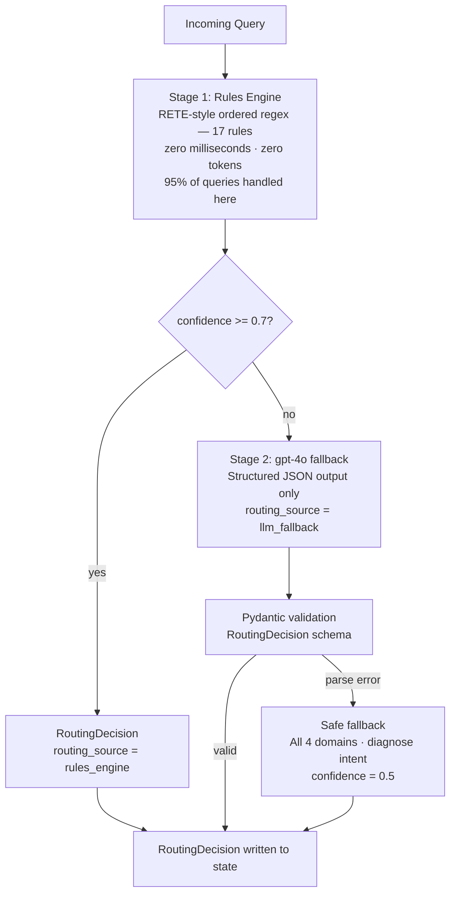

### Rules Coverage

| Pattern | Domains selected | Intent |
|---|---|---|
| "last time", "has this happened", "happened before" | none | `memory_query` |
| "previously", "history", "similar incident" | none | `memory_query` |
| "why … drop / decline / fell / fall / down" | sales, inventory, marketing, support | `diagnose` |
| "sales / revenue / orders / AOV / GMV" | sales | `diagnose` |
| "stock / inventory / SKU" | inventory | `diagnose` |
| "campaign / ads / marketing / promotion / ROAS / paused" | marketing | `diagnose` |
| "complaint / refund / return / support / sentiment" | support | `diagnose` |
| "report / summary / overview / dashboard / health / status" | all four | `report` |
| "restock / replenish" | inventory | `action` |
| "resume / pause … campaign" | marketing | `action` |
| "apply discount / run discount / flash sale" | sales | `action` |
| "increase / boost … budget / spend" | marketing | `action` |
| "fix / resolve … stock / inventory" | inventory | `action` |
| "fix / resolve … campaign / marketing" | marketing | `action` |
| "fix / resolve … complaint / support" | support | `action` |
| "execute / approve" | sales, inventory | `action` |

---

## 11. Database Schema

### Entity Relationship

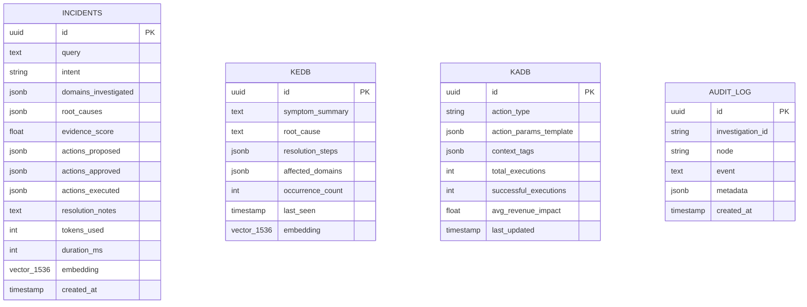

### Table Purposes

| Table | Purpose | Key operation |
|---|---|---|
| `incidents` | Full resolved investigation records | Cosine similarity search on `embedding` column for memory recall |
| `kedb` | Known Error Database — symptom → root cause → resolution | Cosine similarity search; new entries added by memory_writer when novel patterns found |
| `kadb` | Known Action Database — per-action success rates | `SELECT` by `action_type` for synthesis enrichment; `UPDATE` by action_executor after execution |
| `audit_log` | Append-only graph event trail | `SELECT` by `investigation_id` for debugging and compliance |

---

## 12. Pydantic Schema Contracts

Every agent boundary uses typed Pydantic models. No raw strings or untyped dicts pass between nodes.

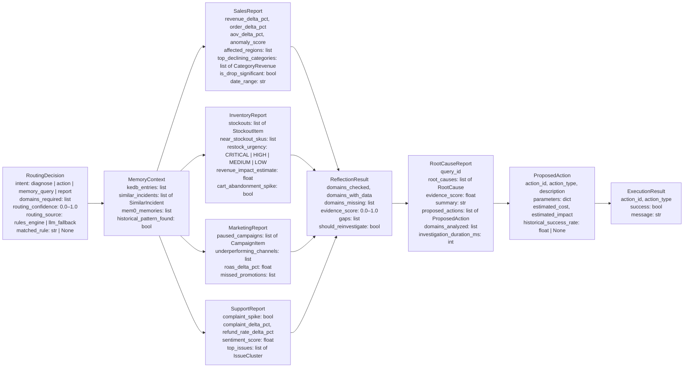

### Key Schema Notes

- `evidence_score` is used (not `confidence_score`) because it is a measurable fraction of data coverage, not a model's subjective certainty.
- `RoutingDecision.matched_rule` records which regex pattern fired, enabling easy debugging of mis-routing.
- `SalesReport.top_declining_categories` accepts both `str` and `CategoryRevenue` objects via a `field_validator` that coerces plain strings — handles both LLM output styles.
- `StockoutItem`, `CampaignItem`, and `IssueCluster` have `field_validator` coercions for numeric fields that the LLM sometimes returns as formatted strings (e.g. `"18.5 hours"` → `18.5`).

---

## 13. API Endpoint Specification

| Method | Path | Auth | Description | Response |
|---|---|---|---|---|
| `POST` | `/api/v1/investigate` | Yes | Start investigation. Returns immediately with `query_id`. | `202 { query_id, thread_id, status }` |
| `GET` | `/api/v1/investigate/{id}/status` | Yes | Poll status. Returns HITL payload when `pending_approval`. | `200 { status, result?, proposed_actions?, error? }` |
| `POST` | `/api/v1/investigate/{id}/resume` | Yes | Submit HITL approval or rejection. | `200 { status }` |
| `GET` | `/api/v1/investigate/{id}/stream` | Yes | SSE stream of graph events (stub). | `text/event-stream` |
| `POST` | `/api/v1/audio/transcribe` | Yes | Upload audio blob, returns Whisper transcription. | `200 { text }` |
| `GET` | `/api/v1/export/incidents` | Yes | Export full incident history as CSV. | `200 text/csv` |
| `GET` | `/health` | No | Service health check. | `200 { status: "ok" }` |
| `GET` | `/docs` | No | FastAPI auto-generated OpenAPI docs. | OpenAPI UI |

### Investigate Request Body
```json
{
  "query": "Why did revenue drop 18% yesterday?",
  "session_id": "user-session-abc",
  "enable_hitl": true
}
```

### HITL Resume Body
```json
{
  "approved": true,
  "approved_action_ids": ["act-abc123", "act-def456"],
  "rejection_reason": null
}
```

### Status Response (pending_approval)
```json
{
  "status": "pending_approval",
  "proposed_actions": [
    {
      "action_id": "act-abc123",
      "action_type": "restock_product",
      "params": { "sku": "ELEC-001", "quantity": 500 },
      "estimated_impact": "Prevent ~$12k stockout revenue loss",
      "dry_run_result": "[DRY RUN] Would restock ELEC-001 with quantity=500",
      "kadb_success_rate": 0.87
    }
  ],
  "root_cause_summary": "Revenue drop driven by 3 stockouts in Electronics..."
}
```

---

## 14. MCP Server Architecture

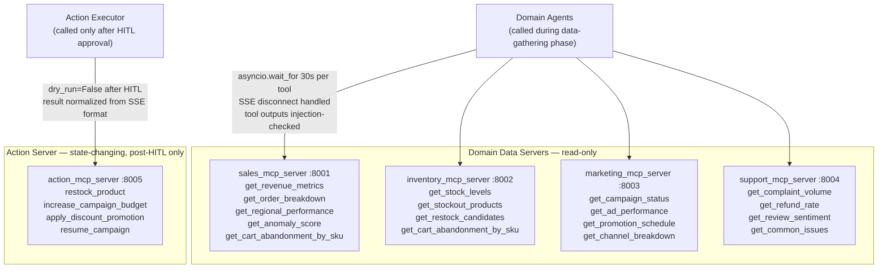

**Why action tools live on a separate server (port 8005):**  
Domain servers (8001–8004) are called during data-gathering with no arguments. If `restock_product` or `resume_campaign` lived on those servers, they would be visible to domain agents during data collection and risked accidental invocation. Isolation on port 8005 means these tools are structurally unreachable during the data-gathering phase.

---

## 15. Memory Architecture

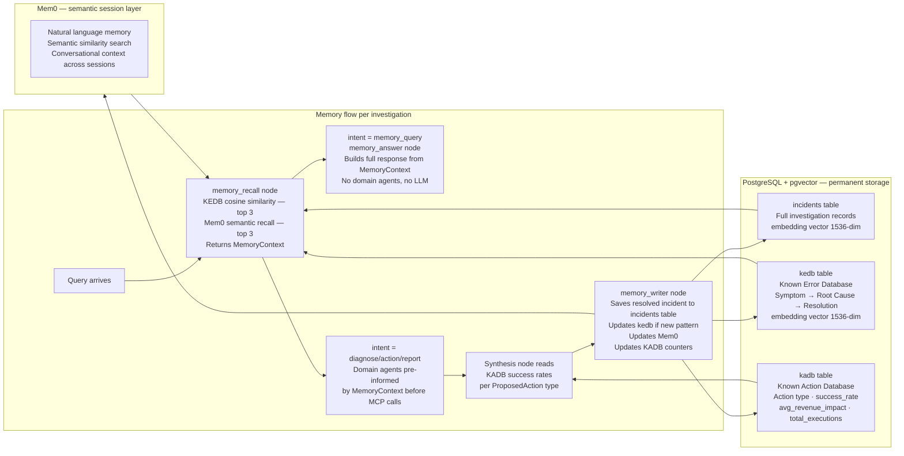

---

## 16. HITL — Human-in-the-Loop Implementation

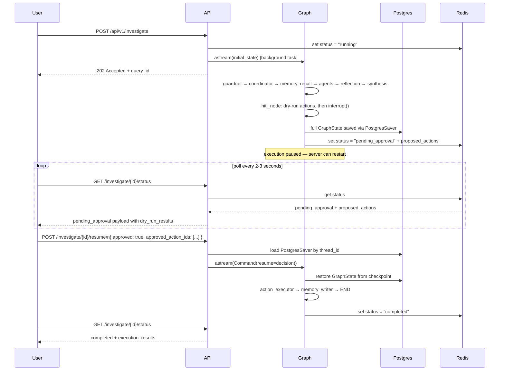

---

## 17. Agent Configuration (YAML-Driven)

Every domain agent is fully defined in `agents/definitions/<name>.yaml`. No Python change is needed to modify agent behaviour.

```yaml
# Example: agents/definitions/sales_agent.yaml
name: sales_agent
model: gpt-4o
temperature: 0.15
max_tokens: 3000
allowed_mcp_servers:
  - sales_mcp_server
tool_whitelist:
  - get_revenue_metrics
  - get_order_breakdown
  - get_regional_performance
  - get_anomaly_score
  - get_cart_abandonment_by_sku
system_prompt: |
  You are a senior e-commerce sales analyst...
```

The `AgentRegistry` loads all YAMLs at startup (cached singleton). The `ToolRegistry` enforces whitelists structurally: tools absent from an agent's whitelist are never passed to its LLM, making accidental tool calls impossible even if the LLM generates them.

---

## 18. Evidence Score Calculation (Reflection Node)

The reflection node is pure Python — no LLM opinion involved. `evidence_score` is a measurable quantity, not a probability estimate.

| Signal | Condition | Max weight |
|---|---|---|
| Domain coverage | `len(domains_with_data) / len(domains_required)` | 0.40 |
| Sales drop | `abs(revenue_delta_pct) / 100`, capped at 0.20, **only if negative** | 0.20 |
| Stockout count | `len(stockouts) × 0.05`, capped at 0.20 | 0.20 |
| Paused campaigns | `len(paused_campaigns) × 0.05`, capped at 0.10 | 0.10 |
| Complaint spike | `0.10` if `complaint_spike == True` | 0.10 |

**Formula:** `score = Σ(signal × weight)`, capped at `1.0`, rounded to 3 decimal places.

**Reinvestigate condition:** `score < 0.7 AND loop_count < 2 AND len(domains_missing) > 0`  
A re-run is pointless if nothing is missing — it would produce the same score. The system only retries when there are specific gaps to fill.

---

## 19. Evaluation Framework

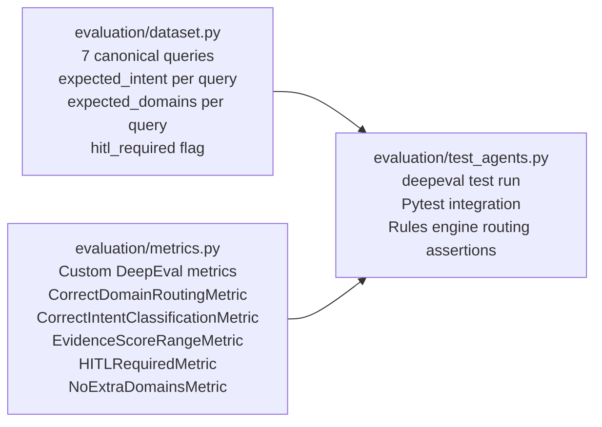

**Test invariants enforced:**

| Invariant | Assertion |
|---|---|
| No false-positive domain selection | A `sales`-only query must not spawn inventory, marketing, or support agents |
| Action intent requires approval | All `ProposedAction` objects from an action-intent query must have `requires_approval=True` |
| Evidence score range | `evidence_score` must be in `[0.0, 1.0]` — never negative, never above 1 |
| Memory query uses zero agents | `domains_required` must be `[]` for a `memory_query` intent |
| Rules engine coverage | All 7 canonical queries must be correctly routed by the rules engine without LLM fallback |

Run: `deepeval test run evaluation/test_agents.py` or `pytest evaluation/ -v`

---

## 20. Observability

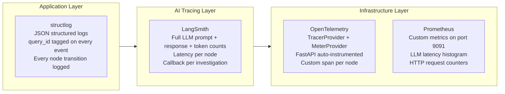

**LLM model tier strategy:**

| Usage | Model | Rationale |
|---|---|---|
| Routing fallback | gpt-4o | Structured JSON only — kept as same deployment to avoid managing a separate mini deployment |
| Domain agents (×4) | gpt-4o | Tool-call analysis and typed report output |
| Synthesis | gpt-4o | Cross-domain narrative requires the full model |
| Reflection | — | Deterministic Python; no LLM |
| Memory answer | — | Deterministic Python; no LLM |
| Embeddings | Azure OpenAI text-embedding-3-small | 1536-dim, API-hosted, consistent with pgvector column dimension |

---

*HLD/LLD prepared for senior architectural review.*  
*Architecture reflects the v1.1 implementation including the memory_answer node addition.*
