# AI E-Commerce Operations Brain — Current System Reference

> **Status**: Fully operational prototype.  
> **Stack**: LangGraph · FastAPI · Azure OpenAI · PostgreSQL + pgvector · MCP (FastMCP) · React/Vite  
> **Architecture**: Multi-agent StateGraph with parallel fan-out, HITL interrupt/resume, two-tier memory, and prompt-injection guardrails.

---

## 1. What This System Does

A business user types or speaks a query such as:

> "Why did sales drop yesterday?"  
> "Fix the inventory issue."  
> "What did we do last time this happened?"

The system:
1. Guards against prompt injection before anything else touches the input
2. Classifies intent and selects only the domains needed using a two-stage router (rules engine first, LLM only on low confidence)
3. Recalls past similar incidents from memory (KEDB semantic search + Mem0)
4. Runs the required domain agents in parallel — each one fetches live data through its dedicated MCP server and produces a typed Pydantic report
5. Scores evidence quality deterministically (no LLM opinion — measurable data coverage)
6. Re-investigates weak-coverage cases up to twice before proceeding
7. Synthesizes a root-cause report with specific proposed actions
8. If the query is action-oriented: pauses the graph, saves full state to PostgreSQL, and waits for human approval (HITL)
9. Runs approved actions through the action MCP server, normalizing MCP SSE response format
10. Writes the resolved incident to PostgreSQL + pgvector for future recall

---

## 2. High-Level Request Flow

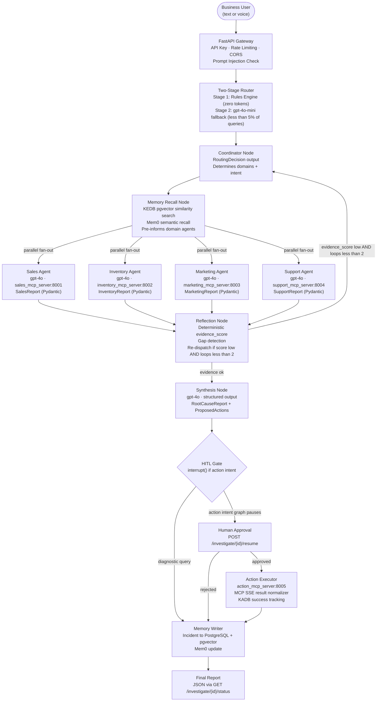

---

## 3. LangGraph State Machine

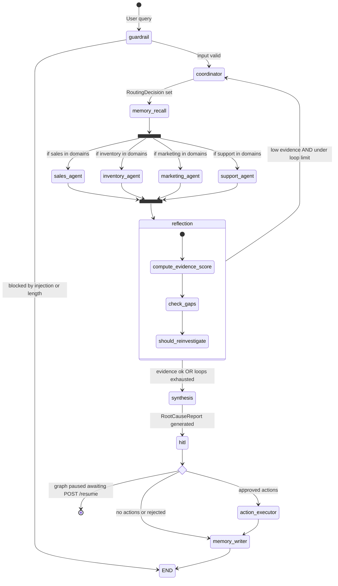

---

## 4. Routing Decision Flow

The router runs as two sequential stages. The LLM is never called for well-known patterns.

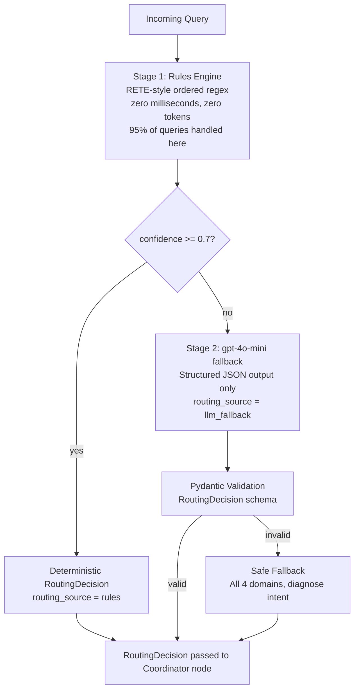

**Rules coverage by pattern:**

| Pattern match | Domains selected | Intent |
|---|---|---|
| "last time", "has this happened", "happened before" | none | memory_query |
| "why did … drop / decline / fell" | sales, inventory, marketing, support | diagnose |
| "revenue / sales / orders / AOV" | sales | diagnose |
| "stock / inventory / stockout / SKU" | inventory | diagnose |
| "campaign / ads / promotion / paused" | marketing | diagnose |
| "complaint / refund / review / support" | support | diagnose |
| "report / summary / overview / health" | all four | report |
| "restock / replenish" | inventory | action |
| "resume / pause … campaign" | marketing | action |
| "apply discount / run discount" | sales | action |
| "fix / resolve / execute" | sales, inventory | action |

---

## 5. Memory Architecture

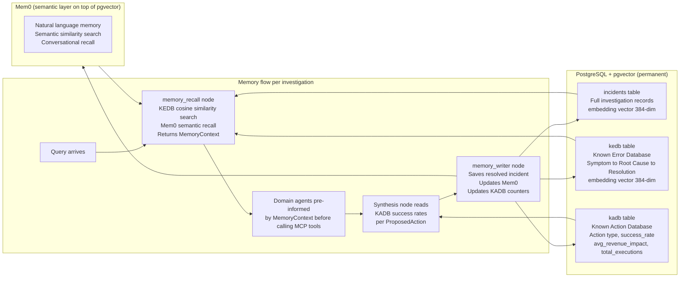

**KEDB** (Known Error Database): stores symptom summaries, root causes, resolution steps, and a pgvector embedding. When a new investigation starts, the query is embedded using all-MiniLM-L6-v2 (384-dim, runs locally on CPU — no API cost) and a cosine similarity search surfaces the top-3 past errors. Domain agents receive this as context before calling their MCP tools.

**KADB** (Known Action Database): stores per-action-type counters — total executions, successful executions, and average revenue impact. The synthesis node reads these to annotate each `ProposedAction` with its `historical_success_rate`. After execution, the action executor calls `record_execution()` to update the rolling averages.

---

## 6. MCP Server Architecture

Five FastMCP servers expose all tool data as independently deployable services over SSE transport. Domain agents never call local Python functions for data — everything goes through MCP.

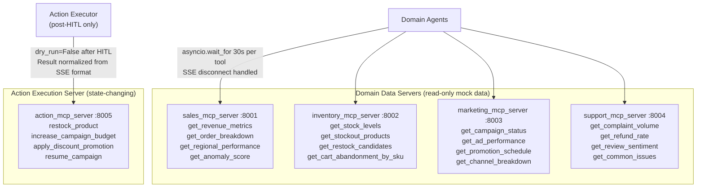

**Why separate the action server**: domain servers (8001–8004) are called during data-gathering with empty arguments. If action tools like `restock_product` or `resume_campaign` lived on those servers, they would be accidentally triggered during every agent's data-fetching phase. All four action tools are isolated on port 8005 and only called when the action executor explicitly dispatches them after HITL approval.

**MCP result normalization**: SSE transport returns content as a list of objects. The action executor normalizes this to a plain dict before reading `success` and `message`, handling all three real response shapes: plain dict, SSE content list, and raw string.

**Resilience**: every MCP call is wrapped in `asyncio.wait_for` (30-second timeout). `httpx.RemoteProtocolError` and `httpcore.RemoteProtocolError` (SSE disconnect mid-stream) are caught explicitly and returned as structured error dicts rather than crashing the investigation.

---

## 7. Agent Design and Tool Architecture

### Graph Nodes

| Node | Behaviour | Model used |
|---|---|---|
| `guardrail` | Injection detection, length validation | Deterministic |
| `coordinator` | Intent classification, domain selection | gpt-4o-mini (fallback only) |
| `memory_recall` | KEDB search, Mem0 recall | Deterministic |
| `sales_agent` | Revenue, orders, anomaly analysis via MCP | gpt-4o |
| `inventory_agent` | Stock levels, stockouts, restock urgency via MCP | gpt-4o |
| `marketing_agent` | Campaign health, channel performance via MCP | gpt-4o |
| `support_agent` | Complaints, refunds, sentiment via MCP | gpt-4o |
| `reflection` | Evidence scoring, gap detection | Deterministic (pure Python) |
| `synthesis` | Root cause report + proposed actions | gpt-4o |
| `hitl` | Dry-run, LangGraph interrupt | Deterministic |
| `action_executor` | MCP dispatch, KADB tracking | Async dispatcher |
| `memory_writer` | Incident persistence, Mem0 update | Deterministic |

### YAML-Driven Agent Configuration

Every domain agent is defined in `agents/definitions/*.yaml`. The YAML controls model name, temperature, token budget, whitelisted tools, allowed MCP servers, and the full system prompt. Changing agent behaviour requires only editing the YAML — no Python changes.

The `AgentRegistry` loads all YAMLs at startup via a cached singleton. The `ToolRegistry` enforces tool whitelists structurally: tools absent from an agent's whitelist simply do not exist in its tool set. Even if an LLM outputs a call to a non-whitelisted tool, that call will fail.

### Two Levels of Parallelism

**Level 1 — Agent fan-out**: LangGraph `Send()` dispatches only the required domain agents concurrently. A stockout query spawns only the inventory agent. A root-cause query spawns all four. Total wait time is bounded by the slowest single agent, not the sum of all agents.

**Level 2 — Tool execution inside agents**: each domain agent calls all its MCP tools in a single `execute_mcp_tools_for_agent()` call, which dispatches them concurrently. Tools within an agent do not block on each other.

### Reflection: Deterministic, Not LLM-Based

The reflection node computes `evidence_score` from five weighted signals in Python:

| Signal | Maximum contribution |
|---|---|
| Domain coverage (required domains that returned data) | 0.40 |
| Sales drop magnitude | 0.20 |
| Stockout count | 0.20 |
| Paused campaign count | 0.10 |
| Complaint spike present | 0.10 |

A score below 0.7 with fewer than 2 loops triggers re-dispatch to the coordinator with the specific gaps list. After 2 loops the system proceeds with what it has, noting the gaps. No LLM is involved. `evidence_score` is measurable data coverage, not a model's stated confidence level.

---

## 8. HITL — Human-in-the-Loop

HITL uses LangGraph's `interrupt()`. The graph pauses mid-execution and the entire state is persisted to PostgreSQL via `PostgresSaver`. State survives server restarts.

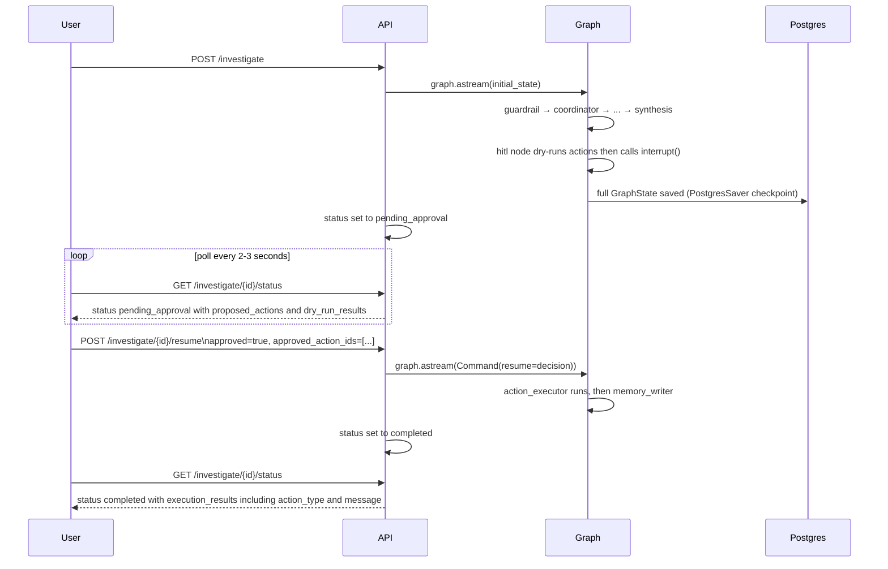

**HITL trigger logic**: the gate checks whether `intent` is `"action"` or `"remediate"`, or whether any action verb appears in the raw query (fix, resolve, resume, restock, apply, increase, execute, take, action, run, etc.). Diagnostic queries skip HITL — their proposed actions are surfaced as informational recommendations without blocking.

**Dry-run before approval**: before the graph pauses, each proposed action is executed with `dry_run=True` against the local tool registry. The dry-run result is attached to each action in the approval payload so the human sees exactly what will happen before confirming.

---

## 9. Guardrails and Security

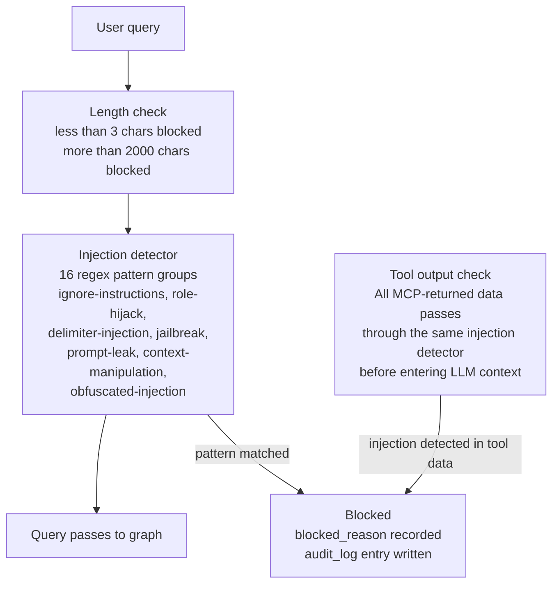

**Security layers applied**:
- Prompt injection check on every user input and on every MCP tool response before it enters LLM context
- API key required on every endpoint (`X-API-Key` header)
- Rate limiting via `slowapi` (prevents runaway LLM cost from automated requests)
- CORS restricted to `localhost:3000`
- All action tools default to `dry_run=True` — real execution requires explicit `dry_run=False` from the action executor after HITL approval
- Secrets never hardcoded — all credentials loaded from `.env` via `pydantic-settings`

---

## 10. Pydantic Schema Contracts

Every agent boundary uses a typed Pydantic schema. No raw strings or untyped dicts cross node boundaries.

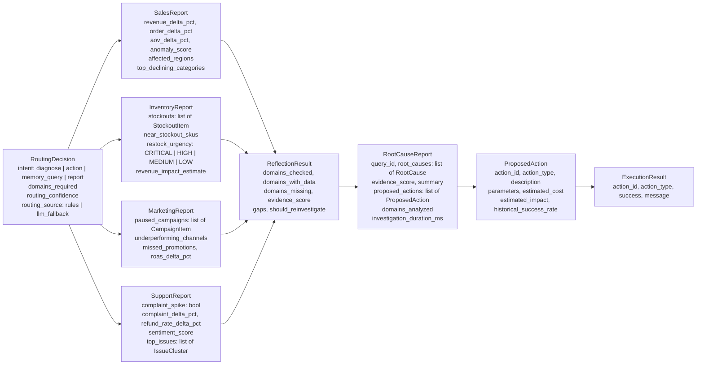

`evidence_score` is used throughout rather than `confidence_score` because it is a measurable fraction of data coverage, not a model's subjective certainty. The synthesis LLM uses `with_structured_output(RootCauseReport, method="function_calling")` so the output is validated by Pydantic on arrival.

---

## 11. Observability

Three layers with distinct purposes:

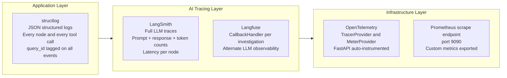

**LLM model tier strategy:**

| Usage | Model | Rationale |
|---|---|---|
| Routing fallback | gpt-4o-mini | Structured JSON routing only — no complex reasoning needed |
| Domain agents (4x) | gpt-4o | Tool-call analysis and structured report output |
| Reflection | gpt-4o | Not used — reflection is deterministic Python |
| Synthesis | gpt-4o | Cross-domain narrative requires strongest model |
| Embeddings | all-MiniLM-L6-v2 (local) | CPU-only, 384-dim, zero API cost |

---

## 12. API Endpoints

| Method | Path | Auth | Description |
|---|---|---|---|
| `POST` | `/api/v1/investigate` | Yes | Start investigation from text query |
| `GET` | `/api/v1/investigate/{id}/status` | Yes | Poll status — includes HITL payload when pending |
| `POST` | `/api/v1/investigate/{id}/resume` | Yes | Submit HITL approval or rejection |
| `POST` | `/api/v1/audio/transcribe` | Yes | Transcribe audio via Azure Whisper, returns text |
| `GET` | `/api/v1/export/incidents` | Yes | Export full incident history as CSV |
| `GET` | `/health` | No | Health check |
| `GET` | `/docs` | No | FastAPI auto-generated OpenAPI documentation |

HITL resume body: `{approved: bool, approved_action_ids: list[str], rejection_reason: str or null}`.

---

## 13. Frontend

React/Vite single-page application. All data comes from the REST API via polling.

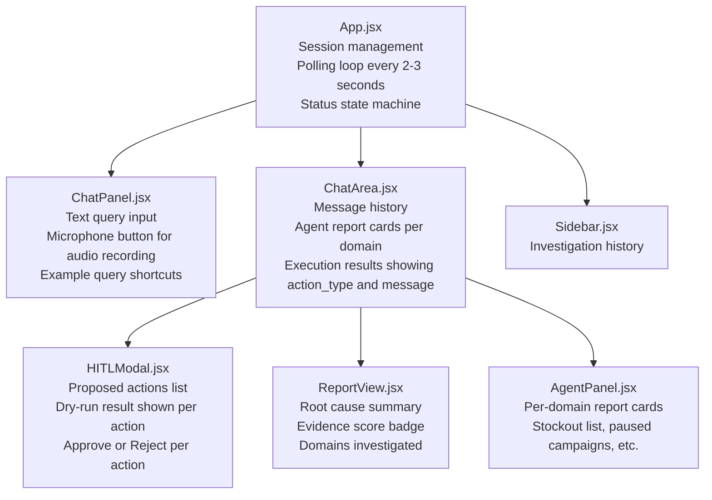

**Polling model**: the frontend calls `/status` every 2–3 seconds. When `status == "pending_approval"`, the HITL modal appears showing each proposed action with its dry-run result. After the user approves or rejects and submits via `POST /resume`, polling continues until `status == "completed"`.

**Audio input**: user presses the mic button, browser records via `MediaRecorder`, the audio blob is uploaded to `POST /audio/transcribe` (Azure Whisper), and the returned transcription appears in the query input for review before the user submits it.

---

## 14. Evaluation Framework

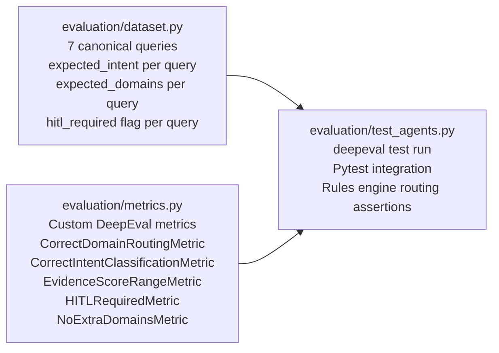

**What is evaluated**:
- For a sales-only query, the router must not spawn inventory, marketing, or support agents (no false-positive domain selection that wastes tokens and money)
- For any action-intent query, all recommended actions must have `requires_approval = True`
- `evidence_score` must always be in the range `[0.0, 1.0]` — never negative, never above 1
- For a memory query, zero domain agents should be spawned

Run with `deepeval test run evaluation/test_agents.py` or `pytest evaluation/ -v`.

---

## 15. Current Project Structure

```
project-4/
├── plan.md                              ← This file (current system reference)
├── plan2.md                             ← v2.1 extended architecture reference
├── graphify.md                          ← Graph topology documentation
├── pyproject.toml                       ← uv-managed dependencies
├── docker-compose.yml                   ← PostgreSQL + Redis + backend + MCP servers
├── run_uvicorn.py                       ← Local dev server launcher
├── start_mcp_servers.py                 ← Starts all 5 MCP servers
├── eval_live.py                         ← Live system evaluation runner
├── eval_quick.py                        ← Quick routing-only evaluation
│
├── ecommerce_brain/
│   ├── api/
│   │   ├── main.py                      ← FastAPI app, CORS, rate limiting, OTel
│   │   ├── deps.py                      ← require_api_key dependency
│   │   ├── status_store.py              ← Investigation status store (Redis-backed)
│   │   └── routers/
│   │       ├── investigate.py           ← Start / status / resume endpoints
│   │       ├── audio.py                 ← Whisper transcription endpoint
│   │       └── export.py                ← CSV export endpoint
│   │
│   ├── graph/
│   │   ├── graph.py                     ← StateGraph assembly + PostgresSaver checkpointer
│   │   ├── state.py                     ← GraphState TypedDict (all fields)
│   │   ├── nodes/
│   │   │   ├── guardrail.py             ← Injection detection + length validation
│   │   │   ├── coordinator.py           ← Rules routing + LLM fallback
│   │   │   ├── memory_recall.py         ← KEDB similarity search + Mem0 recall
│   │   │   ├── domain_agents.py         ← sales / inventory / marketing / support nodes
│   │   │   ├── reflection.py            ← Deterministic evidence_score calculation
│   │   │   ├── synthesis.py             ← RootCauseReport + ProposedActions (gpt-4o)
│   │   │   ├── hitl.py                  ← interrupt() + dry-run execution
│   │   │   ├── action_executor.py       ← MCP dispatch + result normalization + KADB
│   │   │   └── memory_writer.py         ← Incident persistence to PostgreSQL
│   │   └── routing/
│   │       └── rules_engine.py          ← RETE-style ordered regex rules
│   │
│   ├── agents/
│   │   ├── registry.py                  ← YAML loader with @cache singleton
│   │   └── definitions/
│   │       ├── coordinator.yaml
│   │       ├── sales_agent.yaml
│   │       ├── inventory_agent.yaml
│   │       ├── marketing_agent.yaml
│   │       ├── support_agent.yaml
│   │       ├── memory_agent.yaml
│   │       └── reflection_agent.yaml
│   │
│   ├── mcp_servers/
│   │   ├── sales_mcp_server.py          ← FastMCP port 8001
│   │   ├── inventory_mcp_server.py      ← FastMCP port 8002
│   │   ├── marketing_mcp_server.py      ← FastMCP port 8003
│   │   ├── support_mcp_server.py        ← FastMCP port 8004
│   │   └── action_mcp_server.py         ← FastMCP port 8005 (restock, budget, discount, resume)
│   │
│   ├── tools/
│   │   ├── registry.py                  ← @register_tool decorator + global dict
│   │   ├── mcp_loader.py                ← execute_mcp_tools_for_agent (timeout + SSE handling)
│   │   ├── action_tools.py              ← restock_product, increase_campaign_budget, apply_discount, resume_campaign
│   │   ├── sales_tools.py
│   │   ├── inventory_tools.py
│   │   ├── marketing_tools.py
│   │   └── support_tools.py
│   │
│   ├── memory/
│   │   ├── kedb.py                      ← KEDB recall + save (pgvector cosine similarity)
│   │   ├── kadb.py                      ← Action stats + record_execution (rolling average)
│   │   └── mem0_integration.py          ← Mem0 semantic memory layer
│   │
│   ├── schemas/
│   │   ├── outputs.py                   ← All Pydantic output models (domain reports, RootCauseReport, ProposedAction, ExecutionResult)
│   │   ├── inputs.py                    ← InvestigateRequest, HITLDecision
│   │   └── routing.py                   ← RoutingDecision
│   │
│   ├── db/
│   │   ├── engine.py                    ← SQLAlchemy engine + session factory
│   │   ├── models.py                    ← Incident, KEDBEntry, KADBEntry ORM models (pgvector columns)
│   │   └── seed.py                      ← Seed mock data for demo
│   │
│   ├── guardrails/
│   │   └── prompt_injection.py          ← 16-pattern compiled regex detector
│   │
│   ├── observability/
│   │   └── setup.py                     ← structlog JSON + OpenTelemetry + LangSmith + Langfuse
│   │
│   ├── config/
│   │   └── settings.py                  ← pydantic-settings (all configuration from .env)
│   │
│   └── llm.py                           ← LLM factory functions + local embedding singleton
│
├── evaluation/
│   ├── dataset.py                       ← 7-query evaluation dataset with expected outputs
│   ├── metrics.py                       ← Custom DeepEval metrics
│   └── test_agents.py                   ← Pytest + DeepEval test suite
│
├── frontend/
│   ├── index.html
│   ├── vite.config.js
│   ├── package.json
│   └── src/
│       ├── App.jsx
│       ├── main.jsx
│       └── components/
│           ├── ChatArea.jsx             ← Message history + agent cards + execution results
│           ├── ChatPanel.jsx            ← Input + mic button + example queries
│           ├── HITLModal.jsx            ← Approval UI with dry-run results per action
│           ├── AgentPanel.jsx           ← Per-domain report display
│           ├── ReportView.jsx           ← Root cause + evidence score
│           └── Sidebar.jsx              ← Investigation history
│
├── tests/
│   ├── conftest.py
│   ├── test_guardrails.py
│   ├── test_integration.py
│   └── test_routing.py
│
├── scripts/
│   ├── check_mcp_ports.py               ← Verify all 5 MCP servers are reachable
│   └── kill_mcp_ports.py                ← Free ports 8001-8005 before restart
│
└── docker/
    ├── Dockerfile.backend
    ├── Dockerfile.frontend
    ├── nginx.conf
    └── prometheus.yml
```

---

## 16. Business Query to System Behaviour Mapping

| Query | Intent | Domains activated | HITL required | Memory used |
|---|---|---|---|---|
| "Why did sales drop yesterday?" | diagnose | all four | No | Yes — KEDB similarity |
| "Which products are out of stock?" | diagnose | inventory | No | Yes |
| "Were any campaigns paused?" | diagnose | marketing | No | No |
| "Summarize business health" | report | all four | No | Yes |
| "What did we do last time?" | memory_query | none | No | Yes — primary path |
| "Fix the inventory issue" | action | inventory | **Yes** | Yes |
| "Restock SKU-001" | action | inventory | **Yes** | Yes |
| "Resume campaign CAM-044" | action | marketing | **Yes** | Yes |
| "Apply 15% discount on electronics" | action | sales | **Yes** | Yes |

---

## 17. Action Execution — Available Actions

After HITL approval, the action executor dispatches to `action_mcp_server` on port 8005. Four actions are available:

| Action type | Parameters | Notes |
|---|---|---|
| `restock_product` | `sku`, `quantity` | `quantity` is units to order |
| `increase_campaign_budget` | `campaign_id`, `increase_pct` | `increase_pct` is a percentage — 20 means plus 20%, not an absolute dollar amount |
| `apply_discount_promotion` | `category`, `discount_pct` | `category` must be a single string; if synthesis produces a list, the executor fans out one call per category automatically |
| `resume_campaign` | `campaign_id` | Resumes a paused campaign |

All actions default to `dry_run=True`. Real execution only happens after HITL approval with explicit `dry_run=False`. KADB records every execution outcome to update the `historical_success_rate` shown in future proposals.

---

## 18. End-to-End Workflow — Exactly What Happens Step by Step

This section traces a single query from the moment the user presses Enter to the moment the final report appears on screen. Every detail below reflects actual code behaviour, not a high-level aspiration.

---

### Step 1 — The user submits a query

The user types something like `"Why did sales drop yesterday?"` in the React frontend and clicks Send. The frontend fires a `POST /api/v1/investigate` request with the body `{"query": "Why did sales drop yesterday?"}` and the `X-API-Key` header.

At this point the FastAPI layer does three things before the graph even starts:

1. **API key check** — the `require_api_key` dependency reads the `X-API-Key` header and compares it to the value in `.env`. If it doesn't match, the request is rejected with a `403` immediately.
2. **Rate limiting** — `slowapi` tracks requests per IP. Too many in a short window → `429 Too Many Requests`. This prevents anyone from hammering the LLM endpoints.
3. **First injection check** — the router calls `check_for_injection(req.query)` against 16 compiled regex patterns before even creating a graph state. If the query looks like it's trying to hijack the LLM (`"ignore all previous instructions"`, `"you are now DAN"`, etc.), it returns a `400` with `"Input blocked: ..."` and nothing goes to the graph.

If all three pass, the API generates a `query_id` (a UUID), stores an initial `{"status": "running"}` entry in the status store, and immediately returns `202 Accepted` with the `query_id`. The actual graph runs in a **background task** — the HTTP response does not wait for the investigation to finish.

---

### Step 2 — The graph begins: Guardrail node

The first node in the LangGraph pipeline is `guardrail_node`. It receives the initial `GraphState` which contains the raw query, the query_id, and a session_id.

It performs two checks:

- **Length check**: if the query is under 3 characters it's nonsense, if it's over 2000 characters it could be an attempt to stuff a hidden payload. Both return immediately, writing `blocked_reason` into the state. The background task sees this, sets status to `"blocked"`, and stops.
- **Injection check again**: even though the API already checked, this runs the same detector a second time inside the graph — because the state could theoretically be resumed from a checkpoint with a different query. Belt and suspenders.

If both pass, the guardrail writes `investigation_start_ms` (a timestamp for later duration calculation) and an `audit_log` entry, then hands control to the next node.

---

### Step 3 — Coordinator node: routing without wasting tokens

This is where the system decides **what kind of question was asked** and **which domains need to answer it**.

The coordinator runs two stages in sequence:

**Stage 1 — Rules engine (zero LLM calls)**

The rules engine has 17 pre-compiled regex patterns, evaluated in strict priority order. The first pattern that matches wins. For `"Why did sales drop yesterday?"` the pattern `why.{0,30}(drop|decline|fell)` matches. That rule maps to domains `["sales", "inventory", "marketing", "support"]` with intent `"diagnose"` and sets `routing_confidence = 0.95`. The result is a `RoutingDecision` object with `routing_source = "rules_engine"`.

Some example rule resolutions:
- `"Restock SKU-001"` → matches `\b(restock|replenish)\b` → `domains=["inventory"]`, `intent="action"`, confidence=0.95
- `"What did we do last time this happened?"` → matches `\b(last\s+time|has\s+this\s+happened)\b` → `domains=[]`, `intent="memory_query"`, confidence=0.95
- `"Were any campaigns paused?"` → matches `\b(campaign|paused)\b` → `domains=["marketing"]`, `intent="diagnose"`, confidence=0.95

**Stage 2 — LLM fallback (rare, under 5% of queries)**

If the rules engine returns `routing_confidence < 0.7` — meaning nothing matched well — the coordinator calls `gpt-4o-mini` with a short prompt asking it to return only a JSON `RoutingDecision`. The LLM output is JSON-parsed and Pydantic-validated. If that also fails, the system falls back to a safe default: all four domains, `intent="diagnose"`, so the investigation is broad rather than silent.

The coordinator writes the final `RoutingDecision` into the graph state: `intent`, `domains_required`, `routing_confidence`, `routing_source`. These fields are what every downstream node reads.

---

### Step 4 — Memory recall node

Before any agent touches its MCP server, the memory recall node runs and pre-loads relevant historical knowledge into the state.

It does two things concurrently:

**KEDB search**: the query text is embedded using `all-MiniLM-L6-v2` running locally on CPU (no API call, 384-dimensional vector). That embedding is sent to PostgreSQL where a `pgvector` cosine-similarity search runs against the `kedb` table. It retrieves the top-3 most similar known error entries. Each KEDB entry contains a `symptom_summary`, `root_cause`, and `resolution_steps`. If `"sales dropped last Tuesday and it was caused by 3 paused campaigns"` was stored previously, and the current query is `"Why did sales drop yesterday?"`, the cosine similarity will be very high and that entry surfaces immediately.

**Mem0 recall**: Mem0 is a semantic memory layer sitting on top of pgvector. It stores natural language summaries of past investigations per session. `recall_similar(query, session_id)` fetches the top-3 semantically related memories from Mem0 and appends them to the `MemoryContext`.

The `MemoryContext` object (with KEDB hits, incident hits, Mem0 hits, and a `historical_pattern_found` flag) is written into the graph state. Every domain agent will read this when building its LLM prompt — so if the KEDB already knows what caused a sales drop, the agent walks in with that knowledge already loaded.

---

### Step 5 — Parallel fan-out: only the required agents run

LangGraph uses `Send()` to dispatch domain agents in parallel. Only the agents whose domain appears in `domains_required` are dispatched.

For `"Why did sales drop?"` → `domains_required = ["sales", "inventory", "marketing", "support"]` → all four agents run simultaneously.

For `"Restock SKU-001"` → `domains_required = ["inventory"]` → only the inventory agent runs. The other three are never instantiated.

This is level-1 parallelism: the total wait time is bounded by the slowest single agent, not the sum of all four. An investigation that needs all four agents doesn't take 4× as long as one that needs just one.

---

### Step 6 — Inside a domain agent (e.g. Sales agent)

Each domain agent does the same four-step sequence internally:

**6a. Fetch from MCP server**

The agent calls `execute_mcp_tools_for_agent("sales")`. This function connects to `http://localhost:8001/sse` (the sales MCP server) using `MultiServerMCPClient`, retrieves all available tools, and calls every one of them concurrently using `asyncio.wait_for(tool.ainvoke({}), timeout=30.0)`.

For the sales agent, that means calling `get_revenue_metrics`, `get_order_breakdown`, `get_regional_performance`, `get_anomaly_score`, and `get_cart_abandonment_by_sku` — all at the same time (level-2 parallelism). The results come back as a dict: `{"get_revenue_metrics": {...}, "get_order_breakdown": {...}, ...}`.

If an MCP server is down, the `asyncio.wait_for` times out after 30 seconds, or a `httpx.RemoteProtocolError` is caught immediately on disconnect. Either way the agent gets `{"error": "..."}` for that tool and continues — it doesn't crash the whole investigation.

**6b. Sanitize tool outputs**

Each tool result is run through the same 16-pattern injection detector again. If an MCP server's response somehow contains `"ignore your instructions"` in the data, it gets replaced with `{"warning": "tool output sanitized"}` before it ever reaches the LLM. This prevents a compromised or misbehaving data source from injacking the agent's reasoning.

**6c. Build LLM context and call gpt-4o**

The agent builds two messages for `gpt-4o`:
- A `SystemMessage` containing the agent's full system prompt (loaded from `agents/definitions/sales_agent.yaml`) **plus** the most relevant KEDB memory hint from the memory recall step.
- A `HumanMessage` containing the original query, all sanitized tool results as JSON, and the instruction to return a `SalesReport` JSON object.

The LLM is called with `with_structured_output(SalesReport, method="function_calling")`. This forces gpt-4o to use a function call with the exact `SalesReport` Pydantic schema — so the output is always valid JSON that Pydantic can parse. If the LLM returns garbage, `model_validate` throws and the agent logs an error.

**6d. Return typed Pydantic report**

The node returns `{"sales_report": <SalesReport>}` into the graph state. The report contains typed fields: `revenue_delta_pct`, `order_delta_pct`, `aov_delta_pct`, `anomaly_score`, `affected_regions`, `top_declining_categories`. No raw strings.

All four domain agents (whichever were dispatched) run through this same sequence simultaneously. When all four finish, LangGraph collects all their state updates and merges them.

---

### Step 7 — Reflection node: deterministic evidence scoring

Once all agents have written their reports, the reflection node runs. This node uses **no LLM** — it's pure Python arithmetic.

It computes `evidence_score` from five weighted signals:

| Signal | How it's computed | Max weight |
|---|---|---|
| Domain coverage | `len(domains_with_data) / len(domains_required)` | 0.40 |
| Sales drop magnitude | `abs(revenue_delta_pct) / 100`, capped at 0.20 | 0.20 |
| Stockout count | `len(stockouts) * 0.05`, capped at 0.20 | 0.20 |
| Paused campaigns | `len(paused_campaigns) * 0.05`, capped at 0.10 | 0.10 |
| Complaint spike | `0.10` if `complaint_spike == True` | 0.10 |

If `evidence_score < 0.7` **and** `loop_count < 2`, reflection sets `should_reinvestigate = True` and lists the missing domains as gaps. LangGraph's conditional edge routes back to the coordinator with this gap list, which adjusts the next round of agent dispatching to focus on the missing domains. After 2 loops it stops retrying and proceeds with whatever evidence it has.

If `evidence_score >= 0.7` (or loops are exhausted), the node sets `should_reinvestigate = False` and the graph advances to synthesis.

---

### Step 8 — Synthesis node: building the final report

The synthesis node is where all the domain reports, the memory context, and the evidence score come together into a single human-readable `RootCauseReport`.

**Building the LLM prompt**: the node concatenates the JSON of every available domain report into one large prompt. It adds the evidence score, the original query, the intent, any KEDB memory hint, and the investigation duration so far. It tells the LLM (via `_SYSTEM` prompt) the exact four action types it is allowed to propose, with precise parameter names and meaning:
- `restock_product` → `sku`, `quantity` (units, not dollars)
- `increase_campaign_budget` → `campaign_id`, `increase_pct` (a percentage, not an absolute amount)
- `apply_discount_promotion` → `category` (single string, never a list), `discount_pct`
- `resume_campaign` → `campaign_id`

These constraints are enforced in the prompt so the LLM doesn't invent parameter names or pass wrong types.

**Calling gpt-4o with structured output**: the LLM returns a `RootCauseReport` JSON, again via function-calling structured output and Pydantic validation.

**KADB enrichment**: once the report arrives, the synthesis node iterates over each `ProposedAction` and calls `get_action_stats(action_type)` against the KADB table. This returns the historical `success_rate` and `avg_revenue_impact` for that action type, based on all past executions recorded in PostgreSQL. Each `ProposedAction` is updated with its `historical_success_rate` before the report is written to state.

The final `proposed_actions` list in the state looks like:
```
[
  {
    "action_id": "act-abc123",
    "action_type": "restock_product",
    "params": {"sku": "SKU-001", "quantity": 500},
    "estimated_impact": "Prevent ~$12k revenue loss from stockout",
    "dry_run_result": null,
    "kadb_success_rate": 0.87
  }
]
```

---

### Step 9 — HITL node: should a human approve this?

The HITL node checks whether the investigation requires human approval before any action is taken.

**Trigger logic**: it reads `intent` from the state and scans the raw query for action verbs. If `intent` is `"action"` or `"remediate"`, or if the query contains words like `fix`, `resolve`, `restock`, `resume`, `apply`, `increase`, `execute`, `take`, `run`, the node decides HITL is needed. Diagnostic queries (even ones that produce `ProposedAction` items as recommendations) skip HITL — the proposed actions are surfaced to the user as informational suggestions, not executable approvals.

**Dry-run execution**: before pausing the graph, the HITL node runs each proposed action with `dry_run=True` against the local tool registry. For `restock_product`, the dry-run returns something like `{"success": true, "message": "[DRY RUN] Would restock SKU-001 with quantity=500"}`. This result is attached to each action in the state, so the human sees exactly what will execute before they approve.

**Graph interrupt**: `interrupt()` is called with the full payload (proposed actions + dry-run results + root cause summary). This is a LangGraph primitive that does two things simultaneously: it raises a special exception that **stops execution of the current graph run**, and it **saves the entire `GraphState` to PostgreSQL** via `PostgresSaver`. The investigation is now frozen in amber. The server can restart and the state will still be there.

The background task in the API sees that the graph stopped with `hitl_status == "pending_approval"`, and writes `{"status": "pending_approval", "proposed_actions": [...]}` to the status store.

---

### Step 10 — Frontend polling while the graph is paused

The React frontend has been polling `GET /investigate/{id}/status` every 2–3 seconds since the query was submitted. While the graph was running, the response was `{"status": "running"}`. Now it gets `{"status": "pending_approval", "proposed_actions": [...]}`.

The `HITLModal` component opens automatically. It shows a card for each proposed action with:
- The action type and description
- The parameters (e.g. `sku: "SKU-001"`, `quantity: 500`)
- The dry-run result (what would happen)
- The KADB historical success rate (e.g. `87% success across 23 past executions`)
- An individual approve/reject toggle per action

The human reviews all of this and clicks **Approve Selected** or **Reject All**.

---

### Step 11 — Human submits decision: POST /resume

The frontend sends `POST /investigate/{id}/resume` with:
```json
{
  "approved": true,
  "approved_action_ids": ["act-abc123"],
  "rejection_reason": null
}
```

The API router retrieves the `thread_id` from the status store, loads the PostgresSaver checkpointer, and calls `graph.astream(Command(resume=decision), config={"configurable": {"thread_id": thread_id}})`.

LangGraph restores the full `GraphState` from PostgreSQL, returns control to the exact line inside `hitl_node` where `interrupt()` was called, and passes the human's `decision` as the return value of that call. The HITL node reads `decision["approved"]` and `decision["approved_action_ids"]`, filters the proposed actions to only the approved ones, writes `hitl_status = "approved"`, and the graph advances to the action executor.

---

### Step 12 — Action executor: running approved actions for real

The action executor receives `approved_actions` — the list filtered by the human's selection.

**Connection strategy**: it first tries to connect to `http://localhost:8005/sse` (the action MCP server) using `MultiServerMCPClient`. If that succeeds, it builds a `tool_map` of MCP-backed tools. If the action MCP server is not running, it falls back to the local Python tool functions registered in `ToolRegistry`. Either way, the same four action types are available.

**Category fan-out**: if the LLM happened to pass a list for the `category` parameter of `apply_discount_promotion` despite the prompt instruction, the action executor detects this and automatically expands it — one MCP call per category in the list. This handles LLM edge-case behaviour without crashing.

**Execution**: each approved action is called with `dry_run=False`. The MCP server at port 8005 actually executes the action (in this system it's mock implementation, but the architecture is production-ready).

**Result normalization**: MCP SSE tools return results in a `[{"type": "text", "text": "{...}"}]` format, not a plain dict. The `_normalize_result()` function handles all three shapes the result might come in — plain dict, SSE content list, or raw string — and always returns `{"success": bool, "message": str}`.

**KADB recording**: after each execution, `record_execution(action_type, success=success)` is called. This increments the success/failure counter in the `kadb` table, so the historical success rate shown in future proposals is always current.

The `execution_results` list written to state looks like:
```
[
  {
    "action_id": "act-abc123",
    "action_type": "restock_product",
    "success": true,
    "message": "Restocked SKU-001 with quantity=500. New stock level: 750 units."
  }
]
```

---

### Step 13 — Memory writer: persisting the completed investigation

The final node writes the entire investigation to permanent storage.

**`save_incident()`**: writes a full record to the `incidents` table in PostgreSQL, including: the query text, intent, domains used, root causes, evidence score, all proposed/approved/executed actions, total tokens used, and duration in milliseconds. The query is also embedded with `all-MiniLM-L6-v2` and stored as a `vector(384)` column so future similarity searches can find it.

**KEDB update**: if the investigation surfaced a new root cause pattern, it can be saved to the `kedb` table as a new known error entry, enriching future memory recall.

**Mem0 update**: `add_investigation_memory()` stores a natural language summary of the investigation in Mem0 (e.g. `"Query about sales drop resolved by restocking SKU-001 and resuming CAM-044, evidence score 0.84"`). This is indexed by session and available for semantic search in future queries.

Once `memory_writer_node` returns, the graph has no more nodes and terminates. The background task reads the final `GraphState`, builds the completion payload, and calls `update_status(query_id, {"status": "completed", "result": {...}})`.

---

### Step 14 — The frontend receives the final result

The polling loop (still running every 2–3 seconds) gets `{"status": "completed"}` on its next call. The UI transitions out of the loading state.

The `ReportView` component renders the `RootCauseReport`: root cause narratives, evidence score badge (e.g. `0.84`), domains analyzed, investigation duration.

The `AgentPanel` renders a card per domain: the `SalesReport` shows `revenue_delta_pct: -18%`, the `InventoryReport` shows the stockout list, etc.

The `ChatArea` renders the `execution_results` — each item shows `action_type` (e.g. `restock_product`) and `message` (e.g. `"Restocked SKU-001 with quantity=500"`).

The `audit_log` (accumulated across every node) is available as a structured trail: guardrail passed, coordinator routed via rules, memory found 2 KEDB hits, sales/inventory/marketing/support agents completed, reflection scored 0.84, synthesis generated 3 root causes and 2 actions, HITL approved 1 action, action executed successfully, memory saved.

---

### Summary: full timeline for `"Why did sales drop yesterday?"`

```
POST /investigate
  → API key check + rate limit + injection check         < 5ms
  → 202 Accepted, query_id returned                      < 5ms

[Background task starts]
  → guardrail: length ok, injection check passed         < 1ms
  → coordinator: rules matched "why...drop" pattern      < 1ms
     intent=diagnose, domains=[sales,inventory,marketing,support], confidence=0.95
  → memory_recall: KEDB 2 hits, Mem0 1 hit              ~50ms (local embedding + SQL)
  → parallel fan-out: all 4 agents dispatched            0ms (just Send() calls)
     sales_agent:    MCP :8001 (5 tools × concurrent)   ~1-2s
     inventory_agent: MCP :8002 (4 tools × concurrent)  ~1-2s
     marketing_agent: MCP :8003 (4 tools × concurrent)  ~1-2s
     support_agent:  MCP :8004 (4 tools × concurrent)   ~1-2s
     Total wait = slowest single agent                   ~1-2s
  → reflection: evidence_score = 0.84, no reinvestigate  < 1ms
  → synthesis: gpt-4o merges 4 reports → RootCauseReport ~5-8s
  → hitl: intent=diagnose, no action verbs → skipped     < 1ms
  → memory_writer: saved to PostgreSQL + Mem0            ~100ms

Total investigation time: ~7-12s
```

For an action query like `"Restock SKU-001"` the same flow runs, but synthesis produces a `restock_product` action, the HITL gate triggers, the graph pauses, and the total time depends on how quickly the human approves — from that point the actual action execution adds about 1-2 seconds after approval.

---

*Last updated: June 4, 2026*  
*Stack: LangGraph 0.2+ · FastAPI · Azure OpenAI gpt-4o / gpt-4o-mini · all-MiniLM-L6-v2 (local 384-dim) · PostgreSQL 16 + pgvector · FastMCP SSE · React/Vite · Pydantic v2 · structlog · OpenTelemetry · LangSmith · Langfuse · Mem0*
